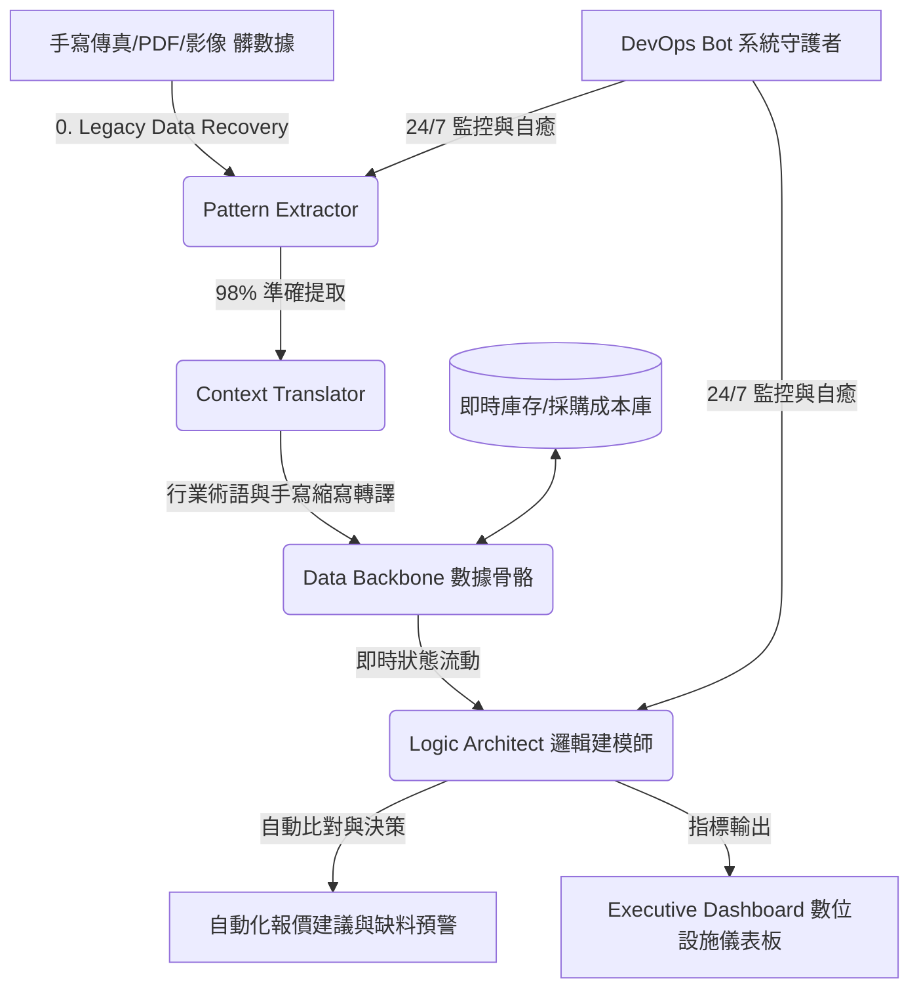

# infra-core-agentics 服務方案：宏達精密零件「數位中樞神經系統 (DCNS)」重構方案

> [!NOTE]  
> 本方案依據 `spec.md` 之技術規範與「技術攻堅派」重構宣言，專為**宏達精密零件 (Hung-Ta Precision)** 量身打造。我們不提供貼補丁式的短視軟體，而是直接為宏達精密重構一套以 AI Agent 為核心的數位中樞神經，協助公司徹底跨越 AI 轉型的 J 曲線谷底。

---

## **0. 專案背景與 COO 診斷報告 (The Audit)**

### **0.1 客戶現狀診斷**
* **客戶對象：** 宏達精密零件（擁有 30 年歷史的汽機車零組件隱形冠軍加工廠）。
* **決策特質：** 第二代接班人高度認同「底層重構」與「系統架構」之價值，預算與時程合理，屬於典型的 **Aligned（高度契合）** 客戶。
* **三大核心病徵：**
  1. **數據黑洞：** 每日 200+ 份格式混雜的 PDF 與手寫傳真，人工處理耗時 4 小時且錯誤率極高。
  2. **邏輯斷層：** 業務端（報價）與生產/倉庫端（庫存、採購成本）數據斷連，盲目報價侵蝕利潤。
  3. **自動化失效：** 傳統套裝 ERP 系統因無法包容現場「髒數據」與非標準化流程，宣告導入失敗。

### **0.2 COO 診斷結論**
宏達精密的痛點並非硬體不足，而是缺乏讓數據自由流動的**數位骨骼**。傳統 ERP 敗在對數據標準性的極度苛求；而我們的 AI-Native 方案能包容傳統產業的「現場模糊性」，透過底層邏輯重構，直接建立一套具備「語意橋樑」的數位中樞。

---

## **1. 數位中樞神經 (DCNS) 架構設計**

我們將為宏達精密佈署 **The Infrastructure Engine (數位基礎設施引擎)**。整體架構分為**數據骨骼 (Data Backbone)** 與**邏輯神經鏈 (Logic Pipeline)** 兩大模組：



### **1.1 數據骨骼 (Data Backbone)**
* **功能：** 串聯即時庫存、最新採購成本與歷史報價單，打破報價與倉庫之間的物理隔閡。
* **特性：** 建立自動化數據提取與清理管道，將不規則的歷史髒數據轉化為可隨時被 Agent 讀取的結構化特徵向量。

### **1.2 邏輯神經鏈 (Logic Pipeline) — 四大專家 Agent 協同**
本專案將派駐三位核心 Specialists 與一位 AI-Native 專家協同運作：

| 專家 Agent | 核心職責 | 品質關卡 (Quality Gate) |
| :--- | :--- | :--- |
| **Pattern Extractor**<br>(模式提取者) | 從混沌的 PDF 與掃描傳真中，精準提取「物料型號」、「規格數量」及客戶採購模式。 | 數據提取準確率 **> 98%**，且識別出的規律須經 COO 複核。 |
| **Context Translator**<br>(語意轉譯者 - AI-Native) | **本專案關鍵。** 負責將現場師傅的口語習慣、手寫字縮寫、非標準材料名稱（如「三號料」轉為標準「SUS304」）即時轉譯為精確指令。 | 語意匹配率 **> 95%**，容許高度模糊的髒數據輸入。 |
| **Logic Architect**<br>(邏輯建模師) | 將報價規則、庫存比對邏輯與採購成本公式轉化為 Agent 執行鏈結。 | 邏輯鏈必須符合**資工狀態機原理**，確保報價與預警輸出 100% 一致。 |
| **DevOps Bot**<br>(系統守護者) | 24/7 全天候監控系統運作，追蹤 API 延遲與 Token 消耗，遇斷線時自動重啟與警報。 | 系統可用性 **> 99.9%**，異常警告觸發時間 **< 30 秒**。 |

---

## **2. 核心解決方案與流程設計**

### **2.1 前置服務：Legacy Data Recovery (舊代數據復原)**
* 在 onboard 診斷階段，強制收集 **100 份原始單據（包含手寫傳真、紙本生產報表）**。
* 由 Pattern Extractor 與 Context Translator 共同進行機器深度學習與 OCR 建模，打通「數據進入」的門檻，作為引擎運行的基礎養分。

### **2.2 招牌服務：Atomic Agent Node (原子級自動化報價單處理節點)**
* **運作機制：** 
  1. 行政同仁將收到的傳真/PDF 直接掃描上傳。
  2. **Pattern Extractor** 自動抓取型號與數量；**Context Translator** 即時轉譯手寫模糊字跡。
  3. **Logic Architect** 讀取 **Data Backbone** 內的「即時倉庫剩餘料件」與「最新採購成本」。
  4. 系統在 **15 分鐘內** 自動產出正確的「排程建議」與「缺料預警紅字提醒」。
* **預期效益：** 行政同仁免除繁重的手手打輸入工作，每天 4 小時的處理時間縮短至 15 分鐘內的「複核與確認」，實現準時下班。

---

## **3. 專案交付物結構 (The Deliverables)**

本專案最終將移交 `PROJECT_HUNG_TA_INFRA` 數位基礎設施交付包，結構如下：

1. **`01_Executive_Dashboard` (數位設施儀表板)**
   * **功能：** 視覺化呈現 Agent 每日處理單據量、數據精準度（OCR 辨識率）、自動化節省工時，以及同仁準時下班率。
2. **`02_Agent_Nodes` (原子 Agent 節點組合)**
   * **Data Miner & Context Translator Config：** 優化後的掃描單據提取模板與材料名詞語意庫。
   * **Logic Chains：** 基於狀態機原理的自動排程與缺料預警邏輯鏈。
3. **`03_System_Blueprint` (可擴充架構藍圖)**
   * **功能：** 提供完整的系統架構圖與標準 API 接口。未來宏達精密可依此藍圖，將系統自主擴展至「出貨通知」與「員工排班」節點，具備「可疊加」的數位能力。
4. **`04_Maintenance_Pack` (維護與監控套件)**
   * **功能：** DevOps Bot 部署腳本與自動化報警設定，確保系統不因網路或 Token 異常停擺。

---

## **4. 服務時程與預算編列**

本專案完全符合客戶預算範圍，時程採階段性漸進交付，兼顧「快速見效」與「底層重構」：

```mermaid
gantt
    title 宏達精密 DCNS 專案時程表 (8 週)
    dateFormat  YYYY-MM-DD
    section 診斷與準備
    髒數據收集與 Legacy Data Recovery :active, d1, 2026-06-01, 7d
    section 原子級 Demo (W1-W2)
    Pattern Extractor 數據打樣與調校 : d2, after d1, 7d
    第一版自動化單元 (Atomic Node) 交付 : Milestone, m1, 2026-06-15, 0d
    section 系統重構與佈署 (W3-W8)
    Data Backbone 與即時庫存串接 : d3, 2026-06-16, 14d
    Logic Architect 工作流建模 : d4, after d3, 14d
    DevOps Bot 佈署與 24/7 壓力測試 : d5, after d4, 7d
    儀表板上線與系統 Handover : d6, after d5, 7d
    全系統正式移交 (Go-Live) : Milestone, m2, 2026-07-27, 0d
```

### **預算規劃**
* **專案總價：** 新台幣 500,000 元（含稅）。
* **付款節點：**
  * **第一期款 (30%)：** 簽約與髒數據 onboard 收集啟動。
  * **第二期款 (40%)：** 第二週完成「原子級報價處理節點」Demo 驗收。
  * **第三期款 (30%)：** 第八週完成系統 Handover 與儀表板 Go-Live。

---

## **5. 我們的承諾與客戶配合事項**

* **我們說不的事 (We Say No To)：**
  * 我們不接受隱瞞庫存數據或業務流程透明度的做法。
  * 我們不提供無底層重構價值的「純 Excel 巨集補丁」。
* **客戶配合事項：**
  * 專案啟動後 3 天內，需提供 100 份歷史手寫單據/傳真掃描件作為 Legency Data 訓練養分。
  * 提供現行老舊 Excel 或資料庫的唯讀存取權（Read-only API/Connection），以便 **Data Backbone** 進行串接。

---

> **COO 簽署意見：**  
> 宏達精密零件具備傳統產業極為珍貴的現場工藝與豐富的歷史單據，其轉型瓶頸完全在於數據傳輸與語意轉譯的「神經斷層」。本方案將透過 AI-Native 的語意轉譯與嚴謹的狀態機邏輯，為宏達精密重塑一套堅固的數位中樞。這將是宏達精密跨越 J 曲線、拉開與競爭對手差距的最關鍵一步。
